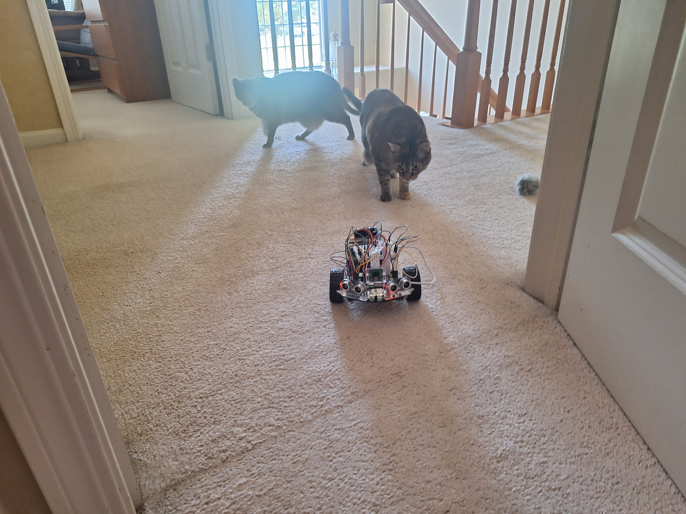
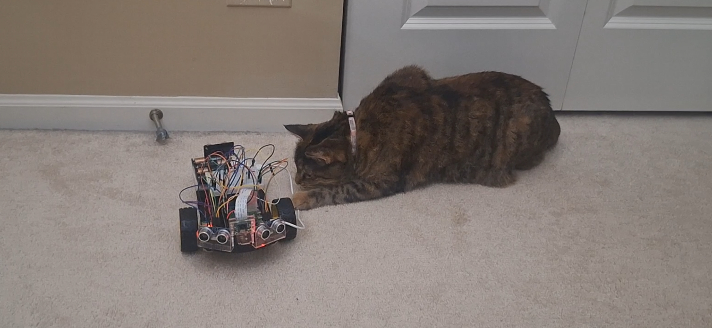
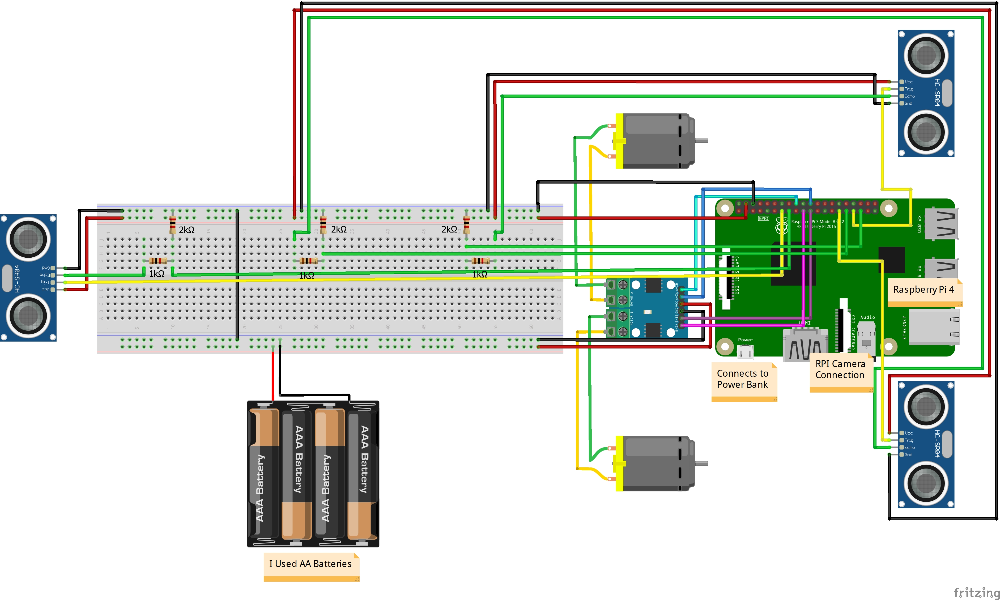

# Ball Tracking Robot
I made a robot that can track and chase a ball while using sensors to avoid colliding with obstacles. I also modified it so that it could run away from the ball instead of moving towards it, and then I adjusted the code to make the robot run away from my cats as well.

| **Engineer** | **School** | **Area of Interest** | **Grade** |
|:--:|:--:|:--:|:--:|
| Kyler G | Naperville North High School | Mechanical Engineering | Incoming Senior

# Final Milestone

My third and final milestone was adding modifications to the ball tracking robot to make it run away from my cats. The first step was having the robot track my cats, which was difficult because the robot's tracking code relies on detecting a solid, consistent color. Since I happened to have collars that I could put on my cat, I decided to tape a piece of green foam to the collar and coded the camera to track the foam's color. Then I just had to change the code so that the robot would run away if the green foam got too close, and I also made the robot move closer if the green foam was too far away (so that the robot doesn't lose sight of the collar and get lost). Again, similar to how the robot tracked the ball, I just had to check the area of green pixels to determine distance. To make sure the robot doesn't collide with anything as it's running away, I also attached a sensor to the back of the robot. As a second modification, I wanted to add an LED to my robot, and I ended up coding the LED so that it would match the color of the center pixel of the camera. Although it seemed pretty easy, this modification came with plenty of challenges; to summarize the main issue, the camera is able to output the colors it is seeing in various forms (such as RGB) and the LED requires a color input in an RGB format, but the camera's RGB format doesn't distinguish different colors very well and is greatly affected by brightness/saturation. To fix this, I utilized HSV, which stands for Hue, Saturation, and Value (brightness). HSV is another format for describing colors, and in this case the hue value is very good for distinguishing colors, and so in my final code I take the hue value from the camera and convert it into RGB for the LED, and this ended up finally working. In fact, the code I used to detect red (and now green) pixels relies mainly on checking if the pixels fall within a certain hue range.

<iframe width="560" height="315" src="https://www.youtube.com/embed/-6v-DRfeFRA?si=38b7YIcXyHZuK_5m" title="YouTube video player" frameborder="0" allow="accelerometer; autoplay; clipboard-write; encrypted-media; gyroscope; picture-in-picture; web-share" referrerpolicy="strict-origin-when-cross-origin" allowfullscreen></iframe>

# Second Milestone

For my second milestone, I wired all the components using the breadboard and RaspberryPi, attached all the remaining parts to the robot, and programmed the robot to track the ball. First, I had to connect my RaspberryPi to my computer so that I could run code on it; this allowed me too test each component after wiring them. Then, once I made sure everything was working, I securely attached the rest of the parts to my robot, which included the breadboard, battery pack, and portable power bank. The breadboard is used to wire everything, the battery pack powers the motors, and the portable charger powers the RaspberryPi. Finally, with the robot fully assembled and wired, I uploaded the ball tracking code onto the RaspberryPi. I encountered some problems with the original code, so I also had to make some changes. For example, the code utilizes the area of the ball in the frame to judge distance, but if part of the ball was cut out of the frame it would appear as if the ball were far away when in reality it was close by and just partly cutoff. Additionally, the code for detecting obstacles with the sensors wasn't working very well, so I also had to fix that. For my final milestone, I plan on adding a modification to the original robot and code.

<iframe width="560" height="315" src="https://www.youtube.com/embed/QMzwgYOOU0o?si=8SxeRTZoUfCtGf7X" title="YouTube video player" frameborder="0" allow="accelerometer; autoplay; clipboard-write; encrypted-media; gyroscope; picture-in-picture; web-share" referrerpolicy="strict-origin-when-cross-origin" allowfullscreen></iframe>

# First Milestone

My first milestone was assembling the physical robot and attaching all of the parts using the kit that I recieved. The kit came with an acrylic plate as the main body of the robot, so I attached the motors and wheels to the bottom of the plate. In the original kit, there was only one sensor that pointed straight forward, but for this project I will need two sensors, one on each side, in order to detect any obstacles in the way of the robot. Additonally, I needed to add a camera to the front of the robot so that it could see the ball and track it. This was the first challenge I had to overcome, as I would have to attach all of these parts onto the robot even though the robot wasn't designed for them. To overcome this, I had to find and repurpose different holes in the plate so that I could screw each of the parts on. Now that I've finished putting together the robot, I will have to start wiring each component to the RaspberryPi and then add the code so that the robot will be able to track the ball.

<iframe width="560" height="315" src="https://www.youtube.com/embed/MZ9oSHlCFnE?si=c6Z2YKkvBLChy1ks" title="YouTube video player" frameborder="0" allow="accelerometer; autoplay; clipboard-write; encrypted-media; gyroscope; picture-in-picture; web-share" referrerpolicy="strict-origin-when-cross-origin" allowfullscreen></iframe>

# Schematics 

# Code

Tracking the Ball:

  <pre style="
    margin: 0;
    white-space: pre-wrap;
    overflow-wrap: anywhere;
    word-break: break-word;
    font-family: Consolas, monospace;
    font-size: 14px;
    line-height: 1.5;
  "><code>

# import the necessary packages
from picamera2 import Picamera2
import RPi.GPIO as GPIO
import time
import cv2
import numpy as np

#hardware work
GPIO.setmode(GPIO.BOARD)

GPIO_TRIGGER1 = 29      #Left ultrasonic sensor
GPIO_ECHO1 = 31

GPIO_TRIGGER3 = 33      #Right ultrasonic sensor
GPIO_ECHO3 = 35

MOTOR1B=21  #Left Motor
MOTOR1E=19

MOTOR2B=22  #Right Motor
MOTOR2E=18

# Set pins as output and input
GPIO.setup(GPIO_TRIGGER1,GPIO.OUT)  # Trigger
GPIO.setup(GPIO_ECHO1,GPIO.IN)      # Echo
GPIO.setup(GPIO_TRIGGER3,GPIO.OUT)  # Trigger
GPIO.setup(GPIO_ECHO3,GPIO.IN)

# Set trigger to False (Low)
GPIO.output(GPIO_TRIGGER1, False)
GPIO.output(GPIO_TRIGGER3, False)

def sonar(GPIO_TRIGGER,GPIO_ECHO):
      start=0
      stop=0
      GPIO.setup(GPIO_TRIGGER,GPIO.OUT)
      GPIO.setup(GPIO_ECHO,GPIO.IN)
      GPIO.output(GPIO_TRIGGER, False)
      time.sleep(0.01)
      GPIO.output(GPIO_TRIGGER, True)
      time.sleep(0.00001)
      GPIO.output(GPIO_TRIGGER, False)
      begin = time.time()
      while GPIO.input(GPIO_ECHO)==0 and time.time()<begin+0.05:
            start = time.time()
      while GPIO.input(GPIO_ECHO)==1 and time.time()<begin+0.1:
            stop = time.time()
      elapsed = stop-start
      distance = elapsed * 34000
      distance = distance / 2
      print("Distance : %.1f" % distance)
      return distance

GPIO.setup(MOTOR1B, GPIO.OUT)
GPIO.setup(MOTOR1E, GPIO.OUT)
GPIO.setup(MOTOR2B, GPIO.OUT)
GPIO.setup(MOTOR2E, GPIO.OUT)

def forward():
      GPIO.output(MOTOR1B, GPIO.HIGH)
      GPIO.output(MOTOR1E, GPIO.LOW)
      GPIO.output(MOTOR2B, GPIO.HIGH)
      GPIO.output(MOTOR2E, GPIO.LOW)

def reverse():
      GPIO.output(MOTOR1B, GPIO.LOW)
      GPIO.output(MOTOR1E, GPIO.HIGH)
      GPIO.output(MOTOR2B, GPIO.LOW)
      GPIO.output(MOTOR2E, GPIO.HIGH)

def rightturn():
      GPIO.output(MOTOR1B, GPIO.LOW)
      GPIO.output(MOTOR1E, GPIO.HIGH)
      GPIO.output(MOTOR2B, GPIO.HIGH)
      GPIO.output(MOTOR2E, GPIO.LOW)

def leftturn():
      GPIO.output(MOTOR1B, GPIO.HIGH)
      GPIO.output(MOTOR1E, GPIO.LOW)
      GPIO.output(MOTOR2B, GPIO.LOW)
      GPIO.output(MOTOR2E, GPIO.HIGH)

def stop():
      GPIO.output(MOTOR1E, GPIO.LOW)
      GPIO.output(MOTOR1B, GPIO.LOW)
      GPIO.output(MOTOR2E, GPIO.LOW)
      GPIO.output(MOTOR2B, GPIO.LOW)

#Image analysis work
def segment_colour(frame):    #returns only the red colors in the frame
    hsv_roi = cv2.cvtColor(frame, cv2.COLOR_BGR2HSV)
    mask_1 = cv2.inRange(hsv_roi, np.array([160, 160, 10]), np.array([180, 255, 255]))
    ycr_roi = cv2.cvtColor(frame, cv2.COLOR_BGR2YCrCb)
    mask_2 = cv2.inRange(ycr_roi, np.array((0., 165., 0.)), np.array((255., 255., 255.)))
    mask = mask_1 | mask_2
    kern_dilate = np.ones((8,8),np.uint8)
    kern_erode  = np.ones((3,3),np.uint8)
    mask= cv2.erode(mask,kern_erode)
    mask=cv2.dilate(mask,kern_dilate)
    return mask

def find_blob(blob):
    largest_contour=0
    cont_index=0
    contours, hierarchy = cv2.findContours(blob, cv2.RETR_CCOMP, cv2.CHAIN_APPROX_SIMPLE)
    for idx, contour in enumerate(contours):
        area=cv2.contourArea(contour)
        if (area > largest_contour):
            largest_contour=area
            cont_index=idx
    r=(0,0,2,2)
    if len(contours) > 0:
        r = cv2.boundingRect(contours[cont_index])
    return r, largest_contour

#CAMERA CAPTURE
camera = Picamera2()
config = camera.create_preview_configuration(main={"size": (160, 120), "format": "RGB888"})
camera.configure(config)
camera.start()

time.sleep(0.1)

flag=0

while True:

      # Setting up Camera      
      frame = camera.capture_array()
      frame = cv2.flip(frame, -1)
      centre_x=0.
      centre_y=0.
      mask_red=segment_colour(frame)
      loct,area=find_blob(mask_red)
      x,y,w,h=loct

      distanceR = sonar(GPIO_TRIGGER1,GPIO_ECHO1)
      distanceL = sonar(GPIO_TRIGGER3,GPIO_ECHO3)

      if (w*h) < 10:
            found=0
      else:
            found=1
            simg2 = cv2.rectangle(frame, (x,y), (x+w,y+h), 255,2)
            centre_x=x+((w)/2)
            centre_y=y+((h)/2)
            cv2.circle(frame,(int(centre_x),int(centre_y)),3,(0,110,255),-1)
            centre_x-=80
            centre_y=60-centre_y
            print(centre_x, centre_y)
      initial=2500

      if (distanceL<5 or distanceR<5):          # Object in the Way
            stop()
            time.sleep(0.1)
            reverse()
            time.sleep(0.0625)
            stop()
            time.sleep(0.0125)

      elif(found==0):                           # Ball not Found
            if flag==0:
                  rightturn()
                  time.sleep(0.05)
            else:
                  leftturn()
                  time.sleep(0.05)
            stop()
            time.sleep(0.0125)

      elif(found==1):
            if(area<initial):                   # Ball is too Far
                  
                  if centre_x > 15:
                        rightturn()
                        time.sleep(0.025)
                        stop()
                        time.sleep(0.0125)
                  
                  elif centre_x < -15:
                        leftturn()
                        time.sleep(0.025)
                        stop()
                        time.sleep(0.0125)
            
                  elif (centre_y<-40 or centre_y>20):
                        stop()
                        time.sleep(0.01)

                  else:
                        forward()
                        time.sleep(0.00625)
            elif(area>=initial):                # Ball is Closer
                  initial2=6700
                  if(area<initial2):
                        if(distanceR>5 and distanceL>5):
                              if(centre_x<=-15 or centre_x>=15):
                                    if(centre_x<0):
                                          flag=1
                                          leftturn()
                                          time.sleep(0.025)
                                          stop()
                                          time.sleep(0.0125)
                                    elif(centre_x>0):
                                          flag=0
                                          rightturn()
                                          time.sleep(0.025)
                                          stop()
                                          time.sleep(0.0125)
                              else:      
                                    forward()
                                    time.sleep(0.00625)
                                    stop()
                                    time.sleep(0.00625)
                        else:
                              stop()
                              time.sleep(0.01)
                  else:                       # Ball is Close Enough
                        stop()
                        time.sleep(0.1)

      #Debugging Purposes, making sure the ball is seen
      cv2.imshow("Camera feed", frame)
      cv2.imshow("Red mask", mask_red)

      if(cv2.waitKey(1) & 0xff == ord('q')):
            break

camera.stop()
cv2.destroyAllWindows()
GPIO.cleanup()

  </code></pre>

Running from Ball:

  <pre style="
    margin: 0;
    white-space: pre-wrap;
    overflow-wrap: anywhere;
    word-break: break-word;
    font-family: Consolas, monospace;
    font-size: 14px;
    line-height: 1.5;
  "><code>

# import the necessary packages
from picamera2 import Picamera2
import RPi.GPIO as GPIO
import time
import cv2
import numpy as np

#hardware work
GPIO.setmode(GPIO.BOARD)

GPIO_TRIGGER1 = 29      #Right ultrasonic sensor
GPIO_ECHO1 = 31

GPIO_TRIGGER3 = 33      #Left ultrasonic sensor
GPIO_ECHO3 = 35

GPIO_TRIGGER5 = 13      #Back ultrasonic sensor
GPIO_ECHO5 = 15

MOTOR1B=21  #Left Motor
MOTOR1E=19

MOTOR2B=22  #Right Motor
MOTOR2E=18

# Set pins as output and input
GPIO.setup(GPIO_TRIGGER1,GPIO.OUT)  # Trigger
GPIO.setup(GPIO_ECHO1,GPIO.IN)      # Echo
GPIO.setup(GPIO_TRIGGER3,GPIO.OUT)  # Trigger
GPIO.setup(GPIO_ECHO3,GPIO.IN)      # Echo
GPIO.setup(GPIO_TRIGGER5,GPIO.OUT)  # Trigger
GPIO.setup(GPIO_ECHO5,GPIO.IN)      # Echo

# Set trigger to False (Low)
GPIO.output(GPIO_TRIGGER1, False)
GPIO.output(GPIO_TRIGGER3, False)
GPIO.output(GPIO_TRIGGER5, False)

def sonar(GPIO_TRIGGER,GPIO_ECHO):
      start=0
      stop=0
      GPIO.setup(GPIO_TRIGGER,GPIO.OUT)
      GPIO.setup(GPIO_ECHO,GPIO.IN)
      GPIO.output(GPIO_TRIGGER, False)
      time.sleep(0.01)
      GPIO.output(GPIO_TRIGGER, True)
      time.sleep(0.00001)
      GPIO.output(GPIO_TRIGGER, False)
      begin = time.time()
      while GPIO.input(GPIO_ECHO)==0 and time.time()<begin+0.05:
            start = time.time()
      while GPIO.input(GPIO_ECHO)==1 and time.time()<begin+0.1:
            stop = time.time()
      elapsed = stop-start
      distance = elapsed * 34000
      distance = distance / 2
      print("Distance : %.1f" % distance)
      return distance

GPIO.setup(MOTOR1B, GPIO.OUT)
GPIO.setup(MOTOR1E, GPIO.OUT)
GPIO.setup(MOTOR2B, GPIO.OUT)
GPIO.setup(MOTOR2E, GPIO.OUT)

def reverse():
      GPIO.output(MOTOR1B, GPIO.HIGH)
      GPIO.output(MOTOR1E, GPIO.LOW)
      GPIO.output(MOTOR2B, GPIO.HIGH)
      GPIO.output(MOTOR2E, GPIO.LOW)

def forward():
      GPIO.output(MOTOR1B, GPIO.LOW)
      GPIO.output(MOTOR1E, GPIO.HIGH)
      GPIO.output(MOTOR2B, GPIO.LOW)
      GPIO.output(MOTOR2E, GPIO.HIGH)

def rightturn():
      GPIO.output(MOTOR1B, GPIO.LOW)
      GPIO.output(MOTOR1E, GPIO.HIGH)
      GPIO.output(MOTOR2B, GPIO.HIGH)
      GPIO.output(MOTOR2E, GPIO.LOW)

def leftturn():
      GPIO.output(MOTOR1B, GPIO.HIGH)
      GPIO.output(MOTOR1E, GPIO.LOW)
      GPIO.output(MOTOR2B, GPIO.LOW)
      GPIO.output(MOTOR2E, GPIO.HIGH)

def stop():
      GPIO.output(MOTOR1E, GPIO.LOW)
      GPIO.output(MOTOR1B, GPIO.LOW)
      GPIO.output(MOTOR2E, GPIO.LOW)
      GPIO.output(MOTOR2B, GPIO.LOW)

#Image analysis work
def segment_colour(frame):    #returns only the red colors in the frame
    hsv_roi = cv2.cvtColor(frame, cv2.COLOR_BGR2HSV)
    mask_1 = cv2.inRange(hsv_roi, np.array([160, 160, 10]), np.array([180, 255, 255]))
    ycr_roi = cv2.cvtColor(frame, cv2.COLOR_BGR2YCrCb)
    mask_2 = cv2.inRange(ycr_roi, np.array((0., 165., 0.)), np.array((255., 255., 255.)))
    mask = mask_1 | mask_2
    kern_dilate = np.ones((8,8),np.uint8)
    kern_erode  = np.ones((3,3),np.uint8)
    mask= cv2.erode(mask,kern_erode)
    mask=cv2.dilate(mask,kern_dilate)
    return mask

def find_blob(blob):
    largest_contour=0
    cont_index=0
    contours, hierarchy = cv2.findContours(blob, cv2.RETR_CCOMP, cv2.CHAIN_APPROX_SIMPLE)
    for idx, contour in enumerate(contours):
        area=cv2.contourArea(contour)
        if (area > largest_contour):
            largest_contour=area
            cont_index=idx
    r=(0,0,2,2)
    if len(contours) > 0:
        r = cv2.boundingRect(contours[cont_index])
    return r, largest_contour

#CAMERA CAPTURE
camera = Picamera2()
config = camera.create_preview_configuration(main={"size": (160, 120), "format": "RGB888"})
camera.configure(config)
camera.start()

time.sleep(0.1)

flag=0

while True:

      # Setting up Camera
      frame = camera.capture_array()
      frame = cv2.flip(frame, -1)
      centre_x=0.
      centre_y=0.
      mask_red=segment_colour(frame)
      loct,area=find_blob(mask_red)
      x,y,w,h=loct

      # Sensors
      distanceR = sonar(GPIO_TRIGGER1,GPIO_ECHO1)
      distanceL = sonar(GPIO_TRIGGER3,GPIO_ECHO3)
      distanceB = sonar(GPIO_TRIGGER5,GPIO_ECHO5)

      if (w*h) < 10:
            found=0
      else:
            found=1
            simg2 = cv2.rectangle(frame, (x,y), (x+w,y+h), 255,2)
            centre_x=x+((w)/2)
            centre_y=y+((h)/2)
            cv2.circle(frame,(int(centre_x),int(centre_y)),3,(0,110,255),-1)
            centre_x-=80
            centre_y=60-centre_y
            print(centre_x, centre_y)
     
      initial=750
      initial2=2000

      if (distanceL<5 or distanceR<5):
            if distanceB<15:                    # Back Sensor
                  stop()
                  time.sleep(0.0125)
            else:
                  forward()
                  time.sleep(0.00625)

      elif(found==0):
            if flag==0:
                  rightturn()
                  time.sleep(0.075)
            else:
                  leftturn()
                  time.sleep(0.075)
            stop()
            time.sleep(0.0125)

      elif(found==1):
            if(area>initial2):                  # Ball is too Close
                  if(centre_x<=-25 or centre_x>=25):
                              if(centre_x<0):
                                    flag=1
                                    leftturn()
                                    time.sleep(0.05)
                                    stop()
                                    time.sleep(0.0125)
                              elif(centre_x>0):
                                    flag=0
                                    rightturn()
                                    time.sleep(0.05)
                                    stop()
                                    time.sleep(0.0125)
                  else:      
                        if distanceB<15:
                              stop()
                              time.sleep(0.0125)
                        else:
                              forward()
                              time.sleep(0.25)
                              stop()
                              time.sleep(0.0125)
      
            elif(area<initial):                 # Ball is too Far
                  if centre_x > 25:
                        rightturn()
                        time.sleep(0.05)
                        stop()
                        time.sleep(0.0125)
                  elif centre_x < -25:
                        leftturn()
                        time.sleep(0.05)
                        stop()
                        time.sleep(0.0125)
                  elif (centre_y<-45 or centre_y>30):
                        stop()
                        time.sleep(0.0125)
                  else:
                        reverse()
                        time.sleep(0.125)
                        stop()
                        time.sleep(0.0125)
            else:                               # Ball is at a Good Distance
                  if(centre_x<-15):
                        flag=1
                        leftturn()
                        time.sleep(0.05)
                        stop()
                        time.sleep(0.00625)
                  elif(centre_x>15):
                        flag=0
                        rightturn()
                        time.sleep(0.05)
                        stop()
                        time.sleep(0.00625)                  

      #Debugging Purposes, making sure the ball is seen
      cv2.imshow("Camera feed", frame)
      cv2.imshow("Red mask", mask_red)

      if(cv2.waitKey(1) & 0xff == ord('q')):
            break

stop()
camera.stop()
cv2.destroyAllWindows()
GPIO.cleanup()

  </code></pre>

Running from Cat:

  <pre style="
    margin: 0;
    white-space: pre-wrap;
    overflow-wrap: anywhere;
    word-break: break-word;
    font-family: Consolas, monospace;
    font-size: 14px;
    line-height: 1.5;
  "><code>

# import the necessary packages
from picamera2 import Picamera2
import RPi.GPIO as GPIO
import time
import cv2
import numpy as np

#hardware work
GPIO.setmode(GPIO.BOARD)

GPIO_TRIGGER1 = 29      #Right ultrasonic sensor
GPIO_ECHO1 = 31

GPIO_TRIGGER3 = 33      #Left ultrasonic sensor
GPIO_ECHO3 = 35

GPIO_TRIGGER5 = 13      #Back ultrasonic sensor
GPIO_ECHO5 = 15

MOTOR1B=21  #Left Motor
MOTOR1E=19

MOTOR2B=22  #Right Motor
MOTOR2E=18

# Set pins as output and input
GPIO.setup(GPIO_TRIGGER1,GPIO.OUT)  # Trigger
GPIO.setup(GPIO_ECHO1,GPIO.IN)      # Echo
GPIO.setup(GPIO_TRIGGER3,GPIO.OUT)  # Trigger
GPIO.setup(GPIO_ECHO3,GPIO.IN)      # Echo
GPIO.setup(GPIO_TRIGGER5,GPIO.OUT)  # Trigger
GPIO.setup(GPIO_ECHO5,GPIO.IN)      # Echo

# Set trigger to False (Low)
GPIO.output(GPIO_TRIGGER1, False)
GPIO.output(GPIO_TRIGGER3, False)
GPIO.output(GPIO_TRIGGER5, False)

def sonar(GPIO_TRIGGER,GPIO_ECHO):
      start=0
      stop=0
      GPIO.setup(GPIO_TRIGGER,GPIO.OUT)
      GPIO.setup(GPIO_ECHO,GPIO.IN)
      GPIO.output(GPIO_TRIGGER, False)
      time.sleep(0.01)
      GPIO.output(GPIO_TRIGGER, True)
      time.sleep(0.00001)
      GPIO.output(GPIO_TRIGGER, False)
      begin = time.time()
      while GPIO.input(GPIO_ECHO)==0 and time.time()<begin+0.05:
            start = time.time()
      while GPIO.input(GPIO_ECHO)==1 and time.time()<begin+0.1:
            stop = time.time()
      elapsed = stop-start
      distance = elapsed * 34000
      distance = distance / 2
      print("Distance : %.1f" % distance)
      return distance

GPIO.setup(MOTOR1B, GPIO.OUT)
GPIO.setup(MOTOR1E, GPIO.OUT)
GPIO.setup(MOTOR2B, GPIO.OUT)
GPIO.setup(MOTOR2E, GPIO.OUT)

def reverse():
      GPIO.output(MOTOR1B, GPIO.HIGH)
      GPIO.output(MOTOR1E, GPIO.LOW)
      GPIO.output(MOTOR2B, GPIO.HIGH)
      GPIO.output(MOTOR2E, GPIO.LOW)

def forward():
      GPIO.output(MOTOR1B, GPIO.LOW)
      GPIO.output(MOTOR1E, GPIO.HIGH)
      GPIO.output(MOTOR2B, GPIO.LOW)
      GPIO.output(MOTOR2E, GPIO.HIGH)

def rightturn():
      GPIO.output(MOTOR1B, GPIO.LOW)
      GPIO.output(MOTOR1E, GPIO.HIGH)
      GPIO.output(MOTOR2B, GPIO.HIGH)
      GPIO.output(MOTOR2E, GPIO.LOW)

def leftturn():
      GPIO.output(MOTOR1B, GPIO.HIGH)
      GPIO.output(MOTOR1E, GPIO.LOW)
      GPIO.output(MOTOR2B, GPIO.LOW)
      GPIO.output(MOTOR2E, GPIO.HIGH)

def stop():
      GPIO.output(MOTOR1E, GPIO.LOW)
      GPIO.output(MOTOR1B, GPIO.LOW)
      GPIO.output(MOTOR2E, GPIO.LOW)
      GPIO.output(MOTOR2B, GPIO.LOW)

#Image analysis work
def segment_colour(frame):    #returns only the green colors in the frame
    hsv_roi = cv2.cvtColor(frame, cv2.COLOR_BGR2HSV)
    mask = cv2.inRange(hsv_roi, np.array([47.5, 125, 50]), np.array([67.5, 200, 150]))
    kern_dilate = np.ones((8,8),np.uint8)
    kern_erode  = np.ones((3,3),np.uint8)
    mask= cv2.erode(mask,kern_erode)
    mask=cv2.dilate(mask,kern_dilate)
    return mask

def find_blob(blob):
    largest_contour=0
    cont_index=0
    contours, hierarchy = cv2.findContours(blob, cv2.RETR_CCOMP, cv2.CHAIN_APPROX_SIMPLE)
    for idx, contour in enumerate(contours):
        area=cv2.contourArea(contour)
        if (area > largest_contour):
            largest_contour=area
            cont_index=idx
    r=(0,0,2,2)
    if len(contours) > 0:
        r = cv2.boundingRect(contours[cont_index])
    return r, largest_contour

#CAMERA CAPTURE
camera = Picamera2()
config = camera.create_preview_configuration(main={"size": (160, 120), "format": "RGB888"})
camera.configure(config)
camera.start()

time.sleep(0.1)

flag=0

while True:
      frame = camera.capture_array()
      frame = cv2.flip(frame, -1)
      centre_x=0.
      centre_y=0.
      mask_red=segment_colour(frame)
      loct,area=find_blob(mask_red)
      x,y,w,h=loct

      distanceR = sonar(GPIO_TRIGGER1,GPIO_ECHO1)
      distanceL = sonar(GPIO_TRIGGER3,GPIO_ECHO3)
      distanceB = sonar(GPIO_TRIGGER5,GPIO_ECHO5)

      if (w*h) < 10:
            found=0
      else:
            found=1
            simg2 = cv2.rectangle(frame, (x,y), (x+w,y+h), 255,2)
            centre_x=x+((w)/2)
            centre_y=y+((h)/2)
            cv2.circle(frame,(int(centre_x),int(centre_y)),3,(0,110,255),-1)
            centre_x-=80
            centre_y=60-centre_y
            print(centre_x, centre_y)
     
      initial=250
      initial2=750

      if (distanceL<5 or distanceR<5):
            if distanceB<15:
                  stop()
                  time.sleep(0.0125)
            else:
                  forward()
                  time.sleep(0.00625)

      elif(found==0):
            if flag==0:
                  rightturn()
                  time.sleep(0.075)
            else:
                  leftturn()
                  time.sleep(0.075)
            stop()
            time.sleep(0.0125)

      elif(found==1):
            if(area>initial2):
                  if(centre_x<=-25 or centre_x>=25):
                              if(centre_x<0):
                                    flag=1
                                    leftturn()
                                    time.sleep(0.05)
                                    stop()
                                    time.sleep(0.0125)
                              elif(centre_x>0):
                                    flag=0
                                    rightturn()
                                    time.sleep(0.05)
                                    stop()
                                    time.sleep(0.0125)
                  else:      
                        if distanceB<15:
                              stop()
                              time.sleep(0.0125)
                        else:
                              forward()
                              time.sleep(0.25)
                              stop()
                              time.sleep(0.0125)
      
            elif(area<initial):
                  if centre_x > 25:
                        rightturn()
                        time.sleep(0.05)
                        stop()
                        time.sleep(0.0125)
                  elif centre_x < -25:
                        leftturn()
                        time.sleep(0.05)
                        stop()
                        time.sleep(0.0125)
                  elif (centre_y<-45 or centre_y>30):
                        stop()
                        time.sleep(0.0125)
                  else:
                        reverse()
                        time.sleep(0.125)
                        stop()
                        time.sleep(0.0125)
            else:
                  if(centre_x<-15):
                        flag=1
                        leftturn()
                        time.sleep(0.05)
                        stop()
                        time.sleep(0.00625)
                  elif(centre_x>15):
                        flag=0
                        rightturn()
                        time.sleep(0.05)
                        stop()
                        time.sleep(0.00625)                  

      #Debugging Purposes, making sure the ball is seen
      cv2.imshow("Camera feed", frame)
      cv2.imshow("Green mask", mask_red)

      if(cv2.waitKey(1) & 0xff == ord('q')):
            break

stop()
camera.stop()
cv2.destroyAllWindows()
GPIO.cleanup()

  </code></pre>

Color Detector:

  <pre style="
    margin: 0;
    white-space: pre-wrap;
    overflow-wrap: anywhere;
    word-break: break-word;
    font-family: Consolas, monospace;
    font-size: 14px;
    line-height: 1.5;
  "><code>

# import the necessary packages
from picamera2 import Picamera2
import RPi.GPIO as GPIO
import time
import cv2
import colorsys
import numpy as np

#hardware work
GPIO.setmode(GPIO.BOARD)

RED = 11                #RGB LED
GREEN = 12
BLUE = 7

GPIO_TRIGGER1 = 29      #Right ultrasonic sensor
GPIO_ECHO1 = 31

GPIO_TRIGGER3 = 33      #Left ultrasonic sensor
GPIO_ECHO3 = 35

GPIO_TRIGGER5 = 13      #Back ultrasonic sensor
GPIO_ECHO5 = 15

MOTOR1B=21  #Left Motor
MOTOR1E=19

MOTOR2B=22  #Right Motor
MOTOR2E=18

# Set pins as output and input
GPIO.setup(GPIO_TRIGGER1,GPIO.OUT)  # Trigger
GPIO.setup(GPIO_ECHO1,GPIO.IN)      # Echo
GPIO.setup(GPIO_TRIGGER3,GPIO.OUT)  # Trigger
GPIO.setup(GPIO_ECHO3,GPIO.IN)      # Echo
GPIO.setup(GPIO_TRIGGER5,GPIO.OUT)  # Trigger
GPIO.setup(GPIO_ECHO5,GPIO.IN)      # Echo

GPIO.setup(RED, GPIO.OUT)           # LED
GPIO.setup(GREEN, GPIO.OUT)
GPIO.setup(BLUE, GPIO.OUT)

# Set trigger to False (Low)
GPIO.output(GPIO_TRIGGER1, False)
GPIO.output(GPIO_TRIGGER3, False)
GPIO.output(GPIO_TRIGGER5, False)

# Setting up LED
redPWM = GPIO.PWM(RED, 1000)
greenPWM = GPIO.PWM(GREEN, 1000)
bluePWM = GPIO.PWM(BLUE, 1000)

redPWM.start(0)
greenPWM.start(0)
bluePWM.start(0)

def sonar(GPIO_TRIGGER,GPIO_ECHO):
      start=0
      stop=0
      GPIO.setup(GPIO_TRIGGER,GPIO.OUT)
      GPIO.setup(GPIO_ECHO,GPIO.IN)
      GPIO.output(GPIO_TRIGGER, False)
      time.sleep(0.01)
      GPIO.output(GPIO_TRIGGER, True)
      time.sleep(0.00001)
      GPIO.output(GPIO_TRIGGER, False)
      begin = time.time()
      while GPIO.input(GPIO_ECHO)==0 and time.time()<begin+0.05:
            start = time.time()
      while GPIO.input(GPIO_ECHO)==1 and time.time()<begin+0.1:
            stop = time.time()
      elapsed = stop-start
      distance = elapsed * 34000
      distance = distance / 2
      print("Distance : %.1f" % distance)
      return distance

GPIO.setup(MOTOR1B, GPIO.OUT)
GPIO.setup(MOTOR1E, GPIO.OUT)
GPIO.setup(MOTOR2B, GPIO.OUT)
GPIO.setup(MOTOR2E, GPIO.OUT)

def forward():
      GPIO.output(MOTOR1B, GPIO.HIGH)
      GPIO.output(MOTOR1E, GPIO.LOW)
      GPIO.output(MOTOR2B, GPIO.HIGH)
      GPIO.output(MOTOR2E, GPIO.LOW)

def reverse():
      GPIO.output(MOTOR1B, GPIO.LOW)
      GPIO.output(MOTOR1E, GPIO.HIGH)
      GPIO.output(MOTOR2B, GPIO.LOW)
      GPIO.output(MOTOR2E, GPIO.HIGH)

def rightturn():
      GPIO.output(MOTOR1B, GPIO.LOW)
      GPIO.output(MOTOR1E, GPIO.HIGH)
      GPIO.output(MOTOR2B, GPIO.HIGH)
      GPIO.output(MOTOR2E, GPIO.LOW)

def leftturn():
      GPIO.output(MOTOR1B, GPIO.HIGH)
      GPIO.output(MOTOR1E, GPIO.LOW)
      GPIO.output(MOTOR2B, GPIO.LOW)
      GPIO.output(MOTOR2E, GPIO.HIGH)

def stop():
      GPIO.output(MOTOR1E, GPIO.LOW)
      GPIO.output(MOTOR1B, GPIO.LOW)
      GPIO.output(MOTOR2E, GPIO.LOW)
      GPIO.output(MOTOR2B, GPIO.LOW)

#CAMERA CAPTURE
camera = Picamera2()
config = camera.create_preview_configuration(main={"size": (160, 120), "format": "RGB888"})
camera.configure(config)
camera.start()

time.sleep(0.1)

flag=0

while True:

      distanceR = sonar(GPIO_TRIGGER1,GPIO_ECHO1)
      distanceL = sonar(GPIO_TRIGGER3,GPIO_ECHO3)
      distanceB = sonar(GPIO_TRIGGER5,GPIO_ECHO5)

      # Setting up frame and finding hue (color)
      frame = camera.capture_array()
      frame = cv2.flip(frame, -1)

      roi = frame[55:65, 75:85]
      hsv_roi = cv2.cvtColor(roi, cv2.COLOR_RGB2HSV)
      hues = hsv_roi[:,:,0]

      # Circular average of hue
      hue_radians = hues * 2 * np.pi / 180

      avg_sin = np.mean(np.sin(hue_radians))
      avg_cos = np.mean(np.cos(hue_radians))

      avg_hue = np.arctan2(avg_sin, avg_cos)

      if avg_hue < 0:
            avg_hue += 2*np.pi

      # Convert hue into RGB
      hue = avg_hue / (2*np.pi)
      b, g, r = colorsys.hsv_to_rgb(hue, 1, 1)

      redPWM.ChangeDutyCycle(r * 100)
      greenPWM.ChangeDutyCycle(g * 100)
      bluePWM.ChangeDutyCycle(b * 100)

      # For troubleshooting (shows camera)
      cv2.rectangle(frame, (75,55), (85,65), (255,255,255), 1)
      cv2.imshow("Camera", frame)

      if cv2.waitKey(1) & 0xFF == ord('q'):
            break

redPWM.stop()
greenPWM.stop()
bluePWM.stop()

stop()
camera.stop()
cv2.destroyAllWindows()
GPIO.cleanup()

  </code></pre>

# Bill of Materials

| **Part** | **Note** | **Price** | **Link** |
|:--:|:--:|:--:|:--:|
| Raspberry Pi Kit | Used to Control the Robot | $147.69 | <a href="https://www.amazon.com/RasTech-Raspberry-Starter-Heatsink-Screwdriver/dp/B0C8LV6VNZ/ref=sr_1_4?crid=3506HY00MCGVM&dib=eyJ2IjoiMSJ9._zkM62vSQ8p7tNr88715LdMv_qHh72Je-tkF9PXEa3chDE53QT4aZu4AGAb4ihE61QY4ZD55nKF6Fp2Kfs8t7AbafM_JrlJFfHo9OB4eAVGqa0EB-7aoBQHPmhKHZ2MW8ny-Kd44bMVlVxPlTWVk5YHIN5P3uKVqrE5Dcal0rKkHny-O6Xyb5ux2AOU6OwVbkag_bqBX66RQNRrgBuz-0pS43mcx93IZTQA9R8NaJJypYU2HAycp-XicTFmyU60a01Nfm9iuyo6B9yA8ppN3OQQyJ-NQ9xyNPxfTLwkqtng.yAYpU6outhQcZmOZhN9Wb6yTw7A85CNUbXZguGInZNg&dib_tag=se&keywords=raspberry%2Bpi%2Bkit&qid=1718848547&s=electronics&sprefix=rasbperry%2Bpi%2Bkit%2Celectronics%2C83&sr=1-4&th=1"> Link </a> |
| Robot Chassis | Provides Basic Structure for the Robot | $28.99 | <a href="https://www.amazon.com/LAFVIN-V2-Bluetooth-Avoidance-Educational/dp/B07YCHCQNK/ref=sr_1_2?crid=18GOP6XS6GGC8&dib=eyJ2IjoiMSJ9.nCHKz0eN9eJ_cQ9_H8MCJA5eBJwLgThwMnwWucR2u8o7IiqRhw2_mP-z3mqc-pXsUNSJN8Ddr4olnSssmPFmN04CjA7GrO-lb1oW5TMEZio6CWu6iphpyjiEO1P9cGxj.2_HkVaXlUrn_fNNVFm0Ij3Fg-wnqx_LzZOXNIGpOpqg&dib_tag=se&keywords=Obstacle%2BAvoidance%2BSmart%2BCar%2BKit%2BV1.2&qid=1785247415&s=electronics&sprefix=obstacle%2Bavoidance%2Bsmart%2Bcar%2Bkit%2Bv1.2%2Celectronics%2C180&sr=1-2&th=1"> Link </a> |
| Screwdriver Kit | Tools to Assemble the Robot | $5.94 | <a href="https://www.amazon.com/Small-Screwdriver-Set-Mini-Magnetic/dp/B08RYXKJW9/"> Link </a> |
| Ultrasonic Sensor | To Detect Obstacles | $9.99 | <a href="https://www.amazon.com/WWZMDiB-HC-SR04-Ultrasonic-Distance-Measuring/dp/B0CQCCGXCP/ref=sr_1_1_sspa?crid=3J2JR973WKPHO&dib=eyJ2IjoiMSJ9.E2SIkElJhtFWCJCHL5Q6Y73Ys_HCMPRVFCIrG_zKv4Og7BdZNtr69Mkju140lhlfzFGQuY542jpsp8FMrtV9d2hCBI7D8lYTH9bcgDXZhs4941uj-d1D69ZYdKmAI1Jig3VmYXOl3axVQ8Jq5L3nGRymNMtNbxkaFqGNyzkq4p37hhxU6jheuoaMo3Onz2FE9ILThkjUbdxRNW3rrZgZ7bYj9mf-yav85hBAmNduYyo.EneY3GmHDfDjDwhdUdDQ4Ktk6fECH62Adb42cEkehRc&dib_tag=se&keywords=ultrasonic%2Bsensor&qid=1715961326&sprefix=ultrasonic%2Bsensor%2Caps%2C72&sr=8-1-spons&sp_csd=d2lkZ2V0TmFtZT1zcF9hdGY&th=1"> Link </a> |
| H Bridges | Used in the Motor Wiring | $8.99 | <a href="https://www.amazon.com/ACEIRMC-Stepper-Controller-2-5-12V-H-Bridge/dp/B0923VMKSZ/"> Link </a> |
| Pi Cam | Camera for Detecting and Tracking the Ball | $12.86 | <a href="https://www.amazon.com/gp/product/B07RWCGX5K/ref=ox_sc_act_title_1?smid=A2IAB2RW3LLT8D&psc=1"> Link </a> |
| Electronics Kit | Needed for the Electronics in the Robot | $11.98 | <a href="https://www.amazon.com/EL-CK-002-Electronic-Breadboard-Capacitor-Potentiometer/dp/B01ERP6WL4/ref=sr_1_4?crid=30T5LTYVQLQ7Z&dib=eyJ2IjoiMSJ9.XZtpck6Llt4UIuYeKM4X3BoXzDuzolZMTCtFDj-oTh1vuIi0HYJZJEdpS-MCdGCK1AWUbUmgoEswoRPxGUSKeGRTzsciRE_l2Vrp8FGX1SxK-HmibPNyHBEtkFJKo_OYmMhkhdCJ4OIH38ALRfFvrXZ7OU5faZVvkTBqod8p7UZYwNwdLCcimwFWGWKaDa-gbbx_TGk7lYQmEbrzeL4UXM-gW3RDtuOV0dCykxwyvYJKCCcOhrK3f18N4NZjiqL_Y5noE1rQTmwyFcG67DzgpNaUPanwIQaYfCe5mgD-njY.v6mU1wYX4M5ShCiyrZMey0hbOwvqLszD8axpHbKlA6I&dib_tag=se&keywords=mini+breadboard+kit&qid=1716419767&s=electronics&sprefix=mini+breadboard+kit%2Celectronics%2C106&sr=1-4"> Link </a> |
| Motors | Turns the Wheels | $11.98 | <a href="https://www.amazon.com/AEDIKO-Motor-Gearbox-200RPM-Ratio/dp/B09N6NXP4H/ref=sr_1_4?crid=1JP29NIWBLH2M&dib=eyJ2IjoiMSJ9.Wq3jKgOLbqtEP772vMD4pV5f-w3PLBdEpKqguykXOb0JFO14f4Dq0m_VDVUMUFtR8WFINUEticI3GXcoGqwXPqK9yIh04PhCktgccMz9zAUiKXMJPwmOTUp_6av3XuFD0lXo9WngN9iKI6YgZrhEEs9qnqbcB1GnvgntCdKz8Q1dFuNu61NgSE6Z8vBk3FRpaNcr1lCI7FApTiNi0Qce8gbfmMn6oUggZQHpIOKKZ6s.M7WsZ_ZZtm3rm93kKgw0NOxt1McVBYX6m55oGxu1xxI&dib_tag=se&keywords=dc+motor+with+gearbox&qid=1715911706&sprefix=dc+motor+with+gearbox%2Caps%2C126&sr=8-4"> Link </a> |
| DMM | Tool for Troubleshooting | $9.99 | <a href="https://www.amazon.com/AstroAI-Digital-Multimeter-Voltage-Tester/dp/B01ISAMUA6/ref=sxin_17_pa_sp_search_thematic_sspa?content-id=amzn1.sym.e8da13fc-7baf-46c3-926a-e7e8f63a520b%3Aamzn1.sym.e8da13fc-7baf-46c3-926a-e7e8f63a520b&cv_ct_cx=digital+multimeter&dib=eyJ2IjoiMSJ9.5LQumrfBR8l0mKnJCJlRg73dxpou0gqYD_ffU3srgs0Utegwth8GcQCSVXVzeZeLSJx5J3itz5TLdmJHsrVITQ.-00jRPoT-bBy26YC4LzQ-S4cYdztgmSMGb83_WEm6HY&dib_tag=se&keywords=digital+multimeter&pd_rd_i=B01ISAMUA6&pd_rd_r=e1ff2570-7e4a-4906-bc55-6f819d48d1bc&pd_rd_w=h7HgL&pd_rd_wg=0ZcFH&pf_rd_p=e8da13fc-7baf-46c3-926a-e7e8f63a520b&pf_rd_r=R6YKX3NXTDQ1PQP4H8RM&qid=1715911879&sbo=RZvfv%2F%2FHxDF%2BO5021pAnSA%3D%3D&sr=1-1-7efdef4d-9875-47e1-927f-8c2c1c47ed49-spons&sp_csd=d2lkZ2V0TmFtZT1zcF9zZWFyY2hfdGhlbWF0aWM&psc=1"> Link </a> |
| Champion Sports Ball | The Tracking Object | $16.73 | <a href="https://www.amazon.com/Champion-Sports-Inch-Coated-Density/dp/B000KYTTYO/ref=sr_1_2_sspa?dib=eyJ2IjoiMSJ9.TLCeZ2jjYwnvK3RiJf14C4RstYOZXhRWTRbHkmLGiNfm5Vd8mVjvtsbUnBFk0S4d6cW9cPT7XDdhwMcPC30nsNwer7Uim0JVF49R8Od82u3RH4TY4mO1uP5LtqdvIEcW7CaOm7AzQ6xOvWQ4say1Ci9eGOxETDRWJP5rewLnqARbrvbe4kh-b2d5NHCLEsarPl16pM1UVlmQCXfMRksXigf_GpckmWPjeUM1AC8iiU0.lGUWr3-ZcZJNl0nJ2JaU6JEUOF9oR26lf0kUvETdmtM&dib_tag=se&keywords=7+inch+red+ball&qid=1748284272&sr=8-2-spons&sp_csd=d2lkZ2V0TmFtZT1zcF9hdGY&psc=1"> Link </a> |
| AA Batteries | Powers the Motors | $18.74 | <a href="https://www.amazon.com/Duracell-Coppertop-AA-Ingredients-Long-lasting/dp/B0035LCFNQ/ref=sr_1_2_sspa?crid=2YR65MVXWA50C&dib=eyJ2IjoiMSJ9.Y7LKJBX-6tZ05fw4EcW76nu14zklVu0uDSTwj-0-cV44GfYvoaYnLKVwcPIB1rWt_qVnpkZnwoqkvrQmMFQ1qiTWN_rokxCgCagwBWaAIiv9PAbMqrwOrkGuvfWfklSZi5Y9W6AaUUspAaSMBZuUyS4cUoJB-s35FE-4seDyYIxfOaNAZggr154hcf3CR015QRyanTdKe1P3g2-fihntxqYoU2ek7H01s8toH4MNd-E.Mnyne8z1KkhvfDMnfFLgjUB9WgjdkdMcYRL591Pngbk&dib_tag=se&keywords=aa+batteries&qid=1748284893&refinements=p_85%3A2470955011&refresh=1&rnid=2470954011&rps=1&sprefix=aa+batterie%2Caps%2C122&sr=8-2-spons&sp_csd=d2lkZ2V0TmFtZT1zcF9hdGY&psc=1"> Link </a> |
| 4 AA Battery Holder | Holds the Motor Batteries | $5.88 | <a href="https://www.amazon.com/VWEICYY-Battery-Holder-housing-Without/dp/B0DZX39MHK/ref=sr_1_4?dib=eyJ2IjoiMSJ9.C9MiWkuBDCwaDoCf2KE7wczzz7mBD4YVdicP3OG1478yvIWqZAy7zdy-0hmtlShIPqiWTzUEAEfEnWMIGN-WsKnFEJjLuzhn395DFkdTl3F23AfrnlPmV8UHVZ_hX14BDJI6alwZJFoUG-M-2W7QrID_NUrRGBKW48VlBJQT7IZpFb7kujDga4Bl7TXOn_vvUH41LGp_7Asx1kjY3rKhZAjM6xlXqEWWm7V_DmK3ReYz_scFCrFeuUpxZZsuwOIgk3ULwE-nudGTdu2-fInmmpt2OUPyzABqnWMDUS-5_QA.3AMs3f1gP42cKX0HK9KpCZ0PuLk2HH9VKYyYf-slpO8&dib_tag=se&keywords=4+AA+battery+pack&qid=1785247872&s=electronics&sr=1-4"> Link </a> |
| USB Power Bank & Cable | Powers the RaspberryPi | $16.19 | <a href="https://www.amazon.com/SIXTHGU-Portable-Charger-Charging-Flashlight/dp/B0C7PHKKNK/ref=sr_1_2_sspa?crid=2ZZM4AAZMMWHQ&dib=eyJ2IjoiMSJ9.W2Zx5_I3mKOn6UpwAzOw6PD0PNh1iaMRBiedequdv9weeWL0HPyPcxJBR9h6-LiFW-sHKnHSApN0sUxx0Q9xIRs80R57IlvvCsmEzXcktogo-4nP-NxrEZOy5dJTcXY8N-PBwfGt4fl_9LP8npenzDUV9TPA8KN6DMu175g6JegC_gZhAJrbqX94EfpQhLwP9vIJH45w2N-AFrfZZOy9jqk55gzVyk4Qst8uZvqn768.KBrc5_SqZ4e8zCpoFc-1C7rk02t3o2ykgDPB65W5JJU&dib_tag=se&keywords=always%2Bon%2Bpower%2Bbank&qid=1715957917&sprefix=always%2Bon%2Bpower%2Bbank%2Caps%2C107&sr=8-2-spons&sp_csd=d2lkZ2V0TmFtZT1zcF9hdGY&th=1"> Link </a> |
| RGB LED | Used in Modification | $9.99 | <a href="https://www.amazon.com/DIYables-Module-Arduino-ESP8266-Raspberry/dp/B0BXKMGSG6/ref=sr_1_1?crid=39F7TRJECKJG6&dib=eyJ2IjoiMSJ9.OE4DihHJQudyqj7AmV4WTfm7759MQCXfsQDHEiHECrys92aXPODfiaqIB5WYcjA-g5bfudoh_m2pNCkitjO18s4pwy-YfaFNqgsGix4n4ZC3EibUQt_LaYFmbNmCP76NuApf-uxpKfu7eG2__Oosk0rUYToiBQThE4COujnhBhHhnUrlcrvbFpUMHhH_78uMBMMKmpYkShlNAclsszRlJWWhMwYOeba8EdR78RE_T3HkmHL3unngPSqVj8A59a_OwAS7qS9pLN8MqTRsneh2BQTehcPM9y9o-dbNZU29_jU.4D3YlLDZH0lYcvosX0C-SfSWXX0vBmBRu_87KDOGHLs&dib_tag=se&keywords=raspberry+pi+rgb+led&qid=1785948149&s=electronics&sprefix=raspberry+pi+rgb+le%2Celectronics%2C164&sr=1-1"> Link </a> |

# Other Resources

- [Ball-Tracking Robot Instructions](https://www.instructables.com/Ball-Tracking-Robot/)
